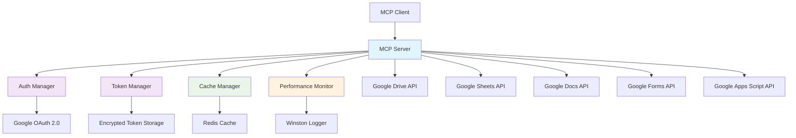

# Google Drive MCP Server

[](https://opensource.org/licenses/MIT)
[](https://www.typescriptlang.org/)
[](https://www.docker.com/)
[](https://redis.io/)

A powerful **Model Context Protocol (MCP) server** that provides comprehensive integration with **Google Workspace** (Drive, Sheets, Docs, Forms, and Apps Script). This server enables AI assistants and applications to seamlessly interact with Google services through a standardized, secure interface.

## 🚀 Quick Start

### 📋 Prerequisites

You'll need a Google account and Node.js 18+ installed.

**📖 [Complete Setup Guide →](./docs/Guides/README.md)**

### ⚡ Fast Track Setup

1. **Google Cloud Setup**
   - Create project at [Google Cloud Console](https://console.cloud.google.com/projectcreate)
   - Enable APIs: Drive, Sheets, Docs, Forms, Apps Script
   - Create OAuth credentials and download as `gcp-oauth.keys.json`
   
   **📖 [Detailed Google Cloud Setup →](./docs/Guides/01-initial-setup.md)**

2. **Installation & Authentication**
   ```bash
   # Clone and install
   git clone https://github.com/AojdevStudio/gdrive.git
   cd gdrive
   npm install && npm run build
   
   # Set up credentials
   mkdir -p credentials
   cp /path/to/gcp-oauth.keys.json credentials/
   
   # Generate encryption key and authenticate
   export GDRIVE_TOKEN_ENCRYPTION_KEY=$(openssl rand -base64 32)
   node ./dist/index.js auth
   ```
   
   **📖 [Complete Authentication Guide →](./docs/Guides/02-authentication-flow.md)**

3. **Start Server**
   ```bash
   node ./dist/index.js
   ```

### 🐳 Docker Setup (Recommended)

```bash
# 1) Prepare bind mounts on the HOST
mkdir -p credentials logs data
cp /path/to/gcp-oauth.keys.json credentials/

# 2) Ensure encryption key is set (32-byte base64)
# Option A: put it in .env at the project root
#   GDRIVE_TOKEN_ENCRYPTION_KEY=<your-32-byte-base64>
# Option B: export in your shell before compose
#   export GDRIVE_TOKEN_ENCRYPTION_KEY=$(openssl rand -base64 32)

# 3) Start with Docker Compose (includes Redis)
docker compose up -d --build   # or: docker-compose up -d --build

# 4) Verify containers
docker compose ps              # expect both services to be 'Up (healthy)'

# 5) Check recent server logs (now include full error details)
docker compose logs gdrive-mcp -n 100 --no-color | cat

# 6) Health check (inside container)
docker compose exec gdrive-mcp-server node dist/index.js health
```

**📖 [Complete Docker Guide →](./docs/Deployment/DOCKER.md)**

## 🚨 Breaking Changes in v3.0.0

**Major Version Update:** Google Drive MCP Server v3.0.0 introduces a **code execution architecture** - a fundamental transformation from calling tools to writing JavaScript code.

### What Changed?

We've replaced **all operation-based tools** with a **single code execution tool**, following Anthropic's MCP engineering best practices for token efficiency and scalability.

**Before (v2.x):** Operation-based tool calls
```json
{
  "name": "sheets",
  "args": {
    "operation": "read",
    "spreadsheetId": "abc123",
    "range": "Sheet1!A1:B10"
  }
}
```

**After (v3.0.0):** Write JavaScript code
```json
{
  "name": "executeCode",
  "args": {
    "code": "import { readSheet } from './modules/sheets';\nconst data = await readSheet({ spreadsheetId: 'abc123', range: 'Sheet1!A1:B10' });\nreturn data;"
  }
}
```

### Why This Improves Your Experience

- **98.7% Token Reduction** - Progressive discovery means only load operations you use
- **Local Data Processing** - Filter/transform data before returning to model (90-95% data reduction)
- **Complex Workflows** - Write loops, conditionals, multi-step logic in single execution
- **Unlimited Scalability** - Foundation for hundreds of operations without context bloat

### Migration Required

**📖 [Complete Migration Guide](./MIGRATION.md)** - Step-by-step instructions with complete operation mapping

All existing tool calls must be converted to JavaScript code. See the migration guide for comprehensive before/after examples covering all 30+ operations.

---

## 💻 Code Execution Architecture (v3.0)

### Overview

Instead of calling individual tools, you write JavaScript code that imports and uses Google Workspace operations directly. This provides massive token efficiency and enables complex workflows.

### Quick Example

**Search and filter files locally:**
```javascript
import { search } from './modules/drive';

// Search once
const results = await search({ query: 'reports 2025' });

// Filter locally (no tokens consumed)
const q1Reports = results.files
  .filter(f => f.name.includes('Q1'))
  .slice(0, 5);

// Return only what's needed
return {
  count: q1Reports.length,
  files: q1Reports.map(f => ({ name: f.name, id: f.id }))
};
```

### Available Modules

#### `./modules/drive` - File Operations
- `search(options)` - Search for files/folders
- `enhancedSearch(options)` - Search with natural language parsing
- `read(options)` - Read file content
- `createFile(options)` - Create new file
- `updateFile(options)` - Update existing file
- `createFolder(options)` - Create new folder
- `batchOperations(options)` - Batch create/update/delete/move

#### `./modules/sheets` - Spreadsheet Operations
- `listSheets(options)` - List all sheets in spreadsheet
- `readSheet(options)` - Read spreadsheet data
- `createSheet(options)` - Create new sheet
- `renameSheet(options)` - Rename sheet
- `deleteSheet(options)` - Delete sheet
- `updateCells(options)` - Update cell values
- `updateCellsWithFormula(options)` - Update with formulas
- `formatCells(options)` - Apply formatting
- `addConditionalFormatting(options)` - Add conditional rules
- `freezeRowsColumns(options)` - Freeze rows/columns
- `setColumnWidth(options)` - Set column widths
- `appendRows(options)` - Append rows

#### `./modules/forms` - Form Operations
- `createForm(options)` - Create new form
- `readForm(options)` - Read form details
- `addQuestion(options)` - Add question to form
- `listResponses(options)` - List form responses

#### `./modules/docs` - Document Operations
- `createDocument(options)` - Create new document
- `insertText(options)` - Insert text at position
- `replaceText(options)` - Replace text
- `applyTextStyle(options)` - Apply text formatting
- `insertTable(options)` - Insert table

### Progressive Tool Discovery

Use the `gdrive://tools` resource to discover available operations on-demand:

```
Resource: gdrive://tools
Returns: Complete hierarchical structure of all modules and functions
```

This enables **progressive discovery** - agents only load documentation for operations they actually use.

### Example Workflows

**Create and populate a spreadsheet:**
```javascript
import { createFile } from './modules/drive';
import { updateCells, formatCells } from './modules/sheets';

// Create spreadsheet
const sheet = await createFile({
  name: 'Q1 Sales Report',
  mimeType: 'application/vnd.google-apps.spreadsheet'
});

// Add data
await updateCells({
  spreadsheetId: sheet.id,
  range: 'Sheet1!A1:C2',
  values: [
    ['Product', 'Revenue', 'Status'],
    ['Widget A', 50000, 'Active']
  ]
});

// Format header
await formatCells({
  spreadsheetId: sheet.id,
  sheetId: 0,
  range: { startRowIndex: 0, endRowIndex: 1 },
  format: {
    textFormat: { bold: true },
    backgroundColor: { red: 0.2, green: 0.4, blue: 0.8 }
  }
});

return { spreadsheetId: sheet.id, url: sheet.webViewLink };
```

**Batch process documents:**
```javascript
import { search, read } from './modules/drive';

const files = await search({ query: 'type:document' });
const summaries = [];

for (const file of files.slice(0, 10)) {
  const content = await read({ fileId: file.id });
  summaries.push({
    name: file.name,
    wordCount: content.split(/\s+/).length,
    hasUrgent: content.includes('urgent')
  });
}

return summaries;
```

### Security & Limits

- **Timeout:** Max 120 seconds (default: 30s)
- **Memory:** Max 128MB per execution
- **CPU:** Limited to timeout duration
- **Isolation:** Sandboxed environment via isolated-vm
- **Access:** Only Google APIs, no filesystem/network

---

## 🔐 Authentication

The server features **automatic OAuth token refresh** with enterprise-grade encryption - authenticate once, works forever.

### ⚡ Quick Authentication

```bash
# Local setup
export GDRIVE_TOKEN_ENCRYPTION_KEY=$(openssl rand -base64 32)
node ./dist/index.js auth

# Docker setup
./scripts/auth.sh
```

**📖 [Complete Authentication Guide →](./docs/Guides/02-authentication-flow.md)**

## 🔗 Claude Desktop Integration

### ⚡ Quick Integration

**Local Setup:**
```json
{
  "mcpServers": {
    "gdrive": {
      "command": "node",
      "args": ["/absolute/path/to/gdrive-mcp/dist/index.js"],
      "env": { "GDRIVE_TOKEN_ENCRYPTION_KEY": "your-key" }
    }
  }
}
```

**Docker Setup (Recommended):**
```json
{
  "mcpServers": {
    "gdrive": {
      "command": "docker",
      "args": ["exec", "-i", "gdrive-mcp-server", "node", "dist/index.js"]
    }
  }
}
```

**Claude Code CLI Setup:**
```bash
claude mcp add --transport stdio gdrive -- docker exec -i gdrive-mcp-server node dist/index.js
```

**📖 [Complete Integration Guide →](./docs/Guides/05-claude-desktop-integration.md)**

## 🚀 Key Features

### 🔐 **Enterprise-Grade Security**
- **Automatic OAuth Token Refresh** - Eliminates manual re-authentication
- **AES-256-GCM Encryption** - Secure token storage at rest
- **Comprehensive Audit Trail** - Full logging of all authentication events
- **Health Monitoring** - Real-time token status and system health checks

### 📁 **Google Drive Operations**
- **File Management** - Create, read, update, delete files and folders
- **Advanced Search** - Natural language queries with intelligent filtering
- **Batch Operations** - Process multiple files efficiently in single operations
- **Format Conversion** - Automatic export of Google Workspace files to readable formats

### 📊 **Google Sheets Integration**
- **Data Access** - Read and write sheet data with A1 notation support
- **Sheet Management** - Create, rename, delete, and list sheets; update cells; append rows
- **Formula Automation** - Apply formulas to specific cells with `updateCellsWithFormula`
- **Cell Formatting** - Apply bold/italic text, colors, and number formats with `formatCells`
- **Conditional Formatting** - Highlight trends with custom rules (e.g., green gains, red losses)
- **Layout Controls** - Freeze header rows/columns and adjust column widths for better readability
- **CSV Export** - Automatic conversion for data analysis

#### Formula Automation Examples

**Add a SUM formula to total a column:**
```javascript
await updateCellsWithFormula({
  spreadsheetId: "your-spreadsheet-id",
  range: "Sheet1!D25",
  formula: "=SUM(D2:D24)"
});
```

**Apply formulas to multiple cells (with relative references):**
```javascript
// This applies the formula to cells E2:E25
// Google Sheets automatically adjusts relative references
// So E2 gets =D2*1.1, E3 gets =D3*1.1, etc.
await updateCellsWithFormula({
  spreadsheetId: "your-spreadsheet-id",
  range: "E2:E25",
  formula: "=D2*1.1"
});
```

**Calculate running totals:**
```javascript
await updateCellsWithFormula({
  spreadsheetId: "your-spreadsheet-id",
  range: "Budget!F10",
  formula: "=SUM(F2:F9)"
});
```

**Use VLOOKUP for data matching:**
```javascript
await updateCellsWithFormula({
  spreadsheetId: "your-spreadsheet-id",
  range: "Sheet1!C2",
  formula: "=VLOOKUP(A2,Prices!A:B,2,FALSE)"
});
```

#### Security Considerations for Formula Operations

When using `updateCellsWithFormula`, be aware of these security considerations:

- **Formula Execution Context**: Formulas execute within Google Sheets' security sandbox
- **External URL Access**: User-crafted formulas can access external URLs via functions like `IMPORTXML`, `IMPORTDATA`, or `IMPORTHTML`
- **Input Validation**: If accepting formula input from users in your application:
  - Validate formula content before passing to the MCP server
  - Consider restricting dangerous functions (IMPORTXML, IMPORTHTML, etc.)
  - Implement allowlists for permitted functions
- **Permission Model**: The MCP server respects Google Drive file permissions - users can only update sheets they have edit access to
- **Data Exposure**: Be cautious with formulas that might expose sensitive data through external requests

**Example validation pattern:**
```javascript
// Validate user-provided formulas
function isSafeFormula(formula) {
  const dangerousFunctions = ['IMPORTXML', 'IMPORTHTML', 'IMPORTDATA', 'IMAGE'];
  const upperFormula = formula.toUpperCase();

  return !dangerousFunctions.some(fn => upperFormula.includes(fn));
}

// Only allow safe formulas
if (isSafeFormula(userFormula)) {
  await updateCellsWithFormula({ spreadsheetId, range, formula: userFormula });
} else {
  throw new Error('Formula contains potentially unsafe functions');
}
```

#### Cell Formatting Examples

**Make headers bold with gray background:**
```javascript
await formatCells({
  spreadsheetId: "your-spreadsheet-id",
  range: "Sheet1!A1:Z1",
  format: {
    bold: true,
    backgroundColor: {
      red: 0.85,
      green: 0.85,
      blue: 0.85
    }
  }
});
```

**Apply currency formatting:**
```javascript
await formatCells({
  spreadsheetId: "your-spreadsheet-id",
  range: "Sheet1!C2:C100",
  format: {
    numberFormat: {
      type: "CURRENCY",
      pattern: "$#,##0.00"
    }
  }
});
```

**Highlight warnings in red:**
```javascript
await formatCells({
  spreadsheetId: "your-spreadsheet-id",
  range: "Sheet1!A10:D10",
  format: {
    foregroundColor: {
      red: 0.8,
      green: 0.2,
      blue: 0.2
    },
    bold: true
  }
});
```

### 📝 **Google Docs Manipulation**
- **Document Creation** - Create documents with content and formatting
- **Text Operations** - Insert, replace, and style text at specific positions
- **Table Management** - Insert tables with custom dimensions
- **Rich Formatting** - Apply bold, italic, underline, colors, and font sizes

### 📋 **Google Forms Builder**
- **Form Creation** - Build forms with titles, descriptions, and various question types
- **Question Types** - Text, multiple choice, checkboxes, linear scales, dates, and more
- **Response Management** - Retrieve and analyze form responses
- **Validation Support** - Required fields and input validation

### 🔧 **Google Apps Script Access**
- **Script Viewing** - Read-only access to Apps Script project source code
- **Multi-File Support** - Handle JavaScript, HTML, and JSON files
- **Syntax Highlighting** - Automatic code formatting in responses

### ⚡ **Performance & Scalability**
- **Redis Caching** - High-performance caching with automatic invalidation
- **Performance Monitoring** - Real-time metrics and statistics tracking
- **Structured Logging** - Winston-based logging with file rotation
- **Docker Support** - Containerized deployment with Docker Compose

## 🏗️ Architecture Overview



### Core Components

- **index.ts** - Main MCP server implementation with consolidated tool handlers
- **AuthManager** - OAuth 2.0 authentication with automatic token refresh
- **TokenManager** - Secure encrypted token storage and lifecycle management
- **CacheManager** - Redis-based caching with intelligent invalidation
- **PerformanceMonitor** - Real-time performance tracking and metrics collection

### Operation-Based Tool Architecture (v2.0.0)

Following [HOW2MCP 2025 best practices](https://github.com/modelcontextprotocol/servers), the server implements an **operation-based tool pattern**:

**Design Pattern:**
```typescript
// Each service has ONE tool with multiple operations
{
  name: "sheets",
  args: {
    operation: "list" | "read" | "create" | ...,  // Operation discriminator
    spreadsheetId: "...",                          // Common parameters
    // ... operation-specific parameters
  }
}
```

**Key Architectural Benefits:**
- **Zod Discriminated Unions** - Type-safe operation routing with compile-time validation
- **Centralized Handlers** - Single tool registration point per service prevents overwriting
- **Cleaner Codebase** - Reduced duplication with shared validation and error handling
- **Better LLM Performance** - 88% reduction in tool count (41+ → 5) enables faster tool selection

**File Structure:**
```
src/
  sheets/
    sheets-handler.ts    # Operation router
    sheets-schemas.ts    # Zod discriminated union schemas
  drive/
    drive-handler.ts
    drive-schemas.ts
  forms/, docs/, batch/  # Similar structure
```

This architecture ensures maintainability, type safety, and optimal LLM integration performance.

## 📚 API Reference

### 📖 Available Tools (v2.0.0)

The server provides **5 consolidated operation-based tools** with **32 total operations**:

#### `sheets` - Google Sheets Operations (12 operations)
Unified tool for all Google Sheets functionality:
- `list` - List all sheets in a spreadsheet
- `read` - Read data from a specific range
- `create` - Create a new sheet in a spreadsheet
- `rename` - Rename an existing sheet
- `delete` - Delete a sheet
- `update` - Update cell values in a range
- `updateFormula` - Apply formulas to cells
- `format` - Apply formatting (bold, colors, number formats)
- `conditionalFormat` - Add conditional formatting rules
- `append` - Append rows to a sheet
- `freeze` - Freeze header rows/columns
- `setColumnWidth` - Adjust column widths

#### `drive` - Google Drive Operations (7 operations)
Unified tool for file and folder management:
- `search` - Search files with natural language queries
- `enhancedSearch` - Advanced search with filters
- `read` - Read file contents
- `create` - Create new files
- `update` - Update existing files
- `createFolder` - Create new folders
- `batch` - Batch file operations

#### `forms` - Google Forms Operations (4 operations)
Unified tool for form creation and management:
- `create` - Create new forms
- `get` - Retrieve form details
- `addQuestion` - Add questions to forms
- `listResponses` - Get form responses

#### `docs` - Google Docs Operations (5 operations)
Unified tool for document manipulation:
- `create` - Create new documents
- `insertText` - Insert text at positions
- `replaceText` - Find and replace text
- `applyTextStyle` - Apply formatting (bold, italic, colors)
- `insertTable` - Insert tables

#### `batch` - Batch File Operations (4 operations)
Unified tool for efficient multi-file processing:
- `create` - Create multiple files
- `update` - Update multiple files
- `delete` - Delete multiple files
- `move` - Move multiple files

### 📂 Resources
- **MCP Resource Access**: `gdrive:///<file_id>` URIs for file access

**📖 [Complete API Documentation →](./docs/Developer-Guidelines/API.md)**

### 🔄 Migration from v1.x

If you're migrating from v1.x, each old tool maps to an operation parameter:

| Old Tool (v1.x) | New Tool (v2.0.0) | Operation |
|-----------------|-------------------|-----------|
| `listSheets` | `sheets` | `"list"` |
| `readSheet` | `sheets` | `"read"` |
| `createSheet` | `sheets` | `"create"` |
| `updateCells` | `sheets` | `"update"` |
| _...and 28 more_ | See [Migration Guide](./docs/MIGRATION_V2.md) | |

**📖 [Complete Migration Guide with All 32 Operations →](./docs/MIGRATION_V2.md)**

### 🎯 Key Capabilities Summary

- **Advanced Search**: Natural language queries with intelligent filtering
- **Batch Operations**: Process multiple files efficiently in single operations
- **Format Conversion**: Automatic export (Docs→Markdown, Sheets→CSV, etc.)
- **Rich Text Editing**: Full document formatting with styles, tables, and positioning
- **Form Builder**: Complete form creation with 8+ question types and validation
- **Apps Script**: Read-only access to Google Apps Script project source code

### 🔒 Security Features
- **AES-256-GCM Encryption** - All tokens encrypted at rest
- **Automatic Token Refresh** - No manual re-authentication needed
- **Comprehensive Audit Trail** - Full logging of authentication events
- **Health Monitoring** - Real-time token status checks

**📖 [Security Documentation →](./docs/Architecture/ARCHITECTURE.md#security)**

## 🔑 Key Rotation

### 🔄 Initial Migration (Required for Existing Installations)

Before upgrading to v2.0.0, migrate your existing tokens to the new versioned encryption system:

```bash
# 1. Backup existing tokens (automatic, but manual backup recommended)
cp .gdrive-mcp-tokens.json .gdrive-mcp-tokens.backup.json

# 2. Run migration script
node scripts/migrate-tokens.js

# 3. Verify migration success
node dist/index.js verify-keys
```

### 🔄 Rotating Encryption Keys

For enhanced security, rotate your encryption keys periodically:

```bash
# Generate new key and re-encrypt all tokens
node dist/index.js rotate-key

# Verify all tokens work with new key
node dist/index.js verify-keys
```

### ⚙️ Key Management Environment Variables

| Variable | Description | Default |
|----------|-------------|---------|
| `GDRIVE_TOKEN_ENCRYPTION_KEY` | Base64-encoded 32-byte encryption key | Auto-generated |
| `GDRIVE_KEY_DERIVATION_ITERATIONS` | PBKDF2 iterations for key strengthening | 100000 |
| `GDRIVE_ROTATION_BACKUP_COUNT` | Number of backup files to retain | 5 |

### 🛠️ CLI Commands

```bash
# Key management commands
node dist/index.js rotate-key          # Rotate encryption key
node dist/index.js verify-keys         # Verify all tokens
node dist/index.js migrate-tokens      # Migrate legacy tokens
node dist/index.js key-status          # Show key version and health
```

### 🚨 Troubleshooting Key Issues

**Token Decryption Failures:**
```bash
# Check key status and version compatibility
node dist/index.js key-status

# Restore from backup if needed
cp .gdrive-mcp-tokens.backup.json .gdrive-mcp-tokens.json
node dist/index.js verify-keys
```

**Performance Issues:**
- Key rotation should complete in < 30 seconds for 100 tokens
- PBKDF2 overhead should be < 5% compared to static key
- Memory usage remains stable during rotation operations

**📖 [Complete Key Rotation Guide →](./docs/Guides/07-key-rotation.md)**

## 🏥 Health Monitoring

```bash
# Check health status
node ./dist/index.js health
```

**Health States:** 🟢 HEALTHY | 🟡 DEGRADED | 🔴 UNHEALTHY

**📖 [Health Monitoring Guide →](./docs/Troubleshooting/README.md#health-monitoring)**

## 💡 Usage Examples

### 🔍 Quick Examples (v2.0.0)

```javascript
// Natural language search with drive tool
await callTool("drive", {
  operation: "search",
  query: "spreadsheets modified last week"
});

// Create document with docs tool
await callTool("docs", {
  operation: "create",
  title: "Project Report",
  content: "# Project Overview\n\nThis document outlines..."
});

// Batch file operations with batch tool
await callTool("batch", {
  operation: "create",
  operations: [
    { type: "create", name: "report.txt", content: "..." },
    { type: "create", name: "notes.txt", content: "..." }
  ]
});

// Update spreadsheet cells with sheets tool
await callTool("sheets", {
  operation: "update",
  spreadsheetId: "abc123",
  range: "Sheet1!A1:B2",
  values: [["Name", "Age"], ["John", 30]]
});
```

**📖 [Complete Examples & Code Samples →](./docs/Examples/README.md)**


## 🛡️ Security Features

### 🔐 Enterprise-Grade Protection
- **AES-256-GCM Encryption** - All tokens encrypted at rest
- **Automatic Token Refresh** - Eliminates re-authentication
- **Comprehensive Audit Trail** - Full security event logging
- **Robust Error Handling** - Circuit breaker and graceful degradation

**📖 [Complete Security Documentation →](./docs/Architecture/ARCHITECTURE.md#security)**

## ⚙️ Configuration

### 📝 Key Environment Variables

| Variable | Description | Required |
|----------|-------------|----------|
| `GDRIVE_TOKEN_ENCRYPTION_KEY` | 32-byte base64 encryption key | ✅ |
| `GDRIVE_KEY_DERIVATION_ITERATIONS` | PBKDF2 iterations for key strengthening (min: 100000) | ❌ |
| `GDRIVE_ROTATION_BACKUP_COUNT` | Number of backup files to retain during rotation | ❌ |
| `REDIS_URL` | Redis cache connection URL | ❌ |
| `LOG_LEVEL` | Winston logging level (info/debug) | ❌ |

### 📋 Sample .env File
```bash
GDRIVE_TOKEN_ENCRYPTION_KEY=your-32-byte-base64-key
GDRIVE_KEY_DERIVATION_ITERATIONS=100000
GDRIVE_ROTATION_BACKUP_COUNT=5
REDIS_URL=redis://localhost:6379
LOG_LEVEL=info
```

**📖 [Complete Configuration Guide →](./docs/Guides/06-environment-variables.md)**

## 🔧 Troubleshooting

### 🚨 Quick Fixes

**Token Issues:**
```bash
# Check health and re-authenticate if needed
node dist/index.js health
./scripts/auth.sh
```

**Docker Issues:**
```bash
# Check logs and verify mounts
docker compose logs gdrive-mcp -n 100 --no-color | cat
docker compose exec gdrive-mcp-server ls -la /credentials/
docker compose exec gdrive-mcp-server ls -la /app/logs/

# If the server restarts repeatedly:
# - Confirm key present in container env
docker inspect gdrive-mcp-server --format='{{range .Config.Env}}{{println .}}{{end}}' | grep GDRIVE_TOKEN_ENCRYPTION_KEY

# - Ensure host bind-mount directories exist
ls -la credentials logs data

# - Health check from inside the container
docker compose exec gdrive-mcp-server node dist/index.js health
```

**Notes on Logging:**
- Error objects are fully serialized (name, message, stack) and written to `logs/error.log` and `logs/combined.log`.
- Audit trail is written to `logs/gdrive-mcp-audit.log`. Directories are auto-created if missing.

**Token Decryption Compatibility:**
- Tokens are encrypted with AES-256-GCM using a key derived (PBKDF2) from your base key in `GDRIVE_TOKEN_ENCRYPTION_KEY`.
- As long as the same base key is provided, tokens can be decrypted across host and Docker.

**Performance Issues:**
```bash
# Check Redis and system resources
redis-cli ping
docker stats gdrive-mcp-server
```

**📖 [Complete Troubleshooting Guide →](./docs/Troubleshooting/README.md)**

## 🛠️ Development

### 🔧 Development Setup

```bash
# Clone and install
git clone <repository-url>
cd gdrive-mcp-server
npm install

# Set up environment
cp .env.example .env  # Add your encryption key
npm run build

# Development with auto-rebuild
npm run watch
```

### 📦 Available Commands
- `npm run build` - Compile TypeScript
- `npm run watch` - Auto-rebuild on changes
- `npm test` - Run test suite
- `npm run lint` - Code quality checks

**📖 [Complete Development Guide →](./docs/Developer-Guidelines/README.md)**

## 🤝 Contributing

We welcome contributions! Areas where you can help:

- 🐛 **Bug Fixes** - Improve stability
- ✨ **Features** - New Google Workspace integrations
- 📚 **Documentation** - Enhance guides and examples
- 🔧 **Performance** - Optimize caching and API usage
- 🧪 **Testing** - Increase test coverage

### 📋 Quick Process
1. Fork repository and create feature branch
2. Follow TypeScript/ESLint standards
3. Add tests and update documentation
4. Run `npm run lint && npm test && npm run build`
5. Submit pull request with clear description

**📖 [Complete Contributing Guide →](./CONTRIBUTING.md)**

## 📚 Complete Documentation

### 📖 Documentation Index
- **[📚 Documentation Hub](./docs/index.md)** - Complete documentation structure
- **[🚀 Setup Guides](./docs/Guides/README.md)** - Step-by-step installation and setup
- **[📋 API Reference](./docs/Developer-Guidelines/API.md)** - Complete tool documentation
- **[🏗️ Architecture](./docs/Architecture/ARCHITECTURE.md)** - System design and technical details
- **[🐳 Docker Deployment](./docs/Deployment/DOCKER.md)** - Container deployment guide
- **[🔧 Troubleshooting](./docs/Troubleshooting/README.md)** - Common issues and solutions
- **[💼 Business Workflows](./docs/Business-Processes/README.md)** - Business process integration
- **[🧪 Examples](./docs/Examples/README.md)** - Code examples and usage patterns

### 📞 Support
- 🐛 **Issues** - Report bugs via GitHub Issues
- 💬 **Discussions** - Join community discussions
- 📖 **Documentation** - Comprehensive guides available

## 📄 License

This project is licensed under the **MIT License**.

---

<div align="center">

**Built with ❤️ for the MCP ecosystem**

[⭐ Star this repo](https://github.com/AojdevStudio/gdrive) | [🐛 Report Bug](https://github.com/AojdevStudio/gdrive/issues) | [💡 Request Feature](https://github.com/AojdevStudio/gdrive/issues)

</div>