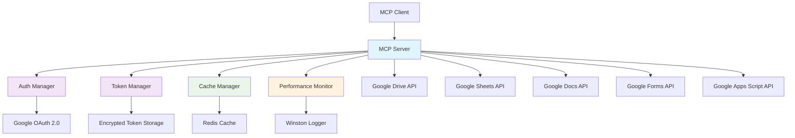

# Google Drive MCP Server

[](https://opensource.org/licenses/MIT)
[](https://www.typescriptlang.org/)
[](https://www.docker.com/)
[](https://redis.io/)

A powerful **Model Context Protocol (MCP) server** that provides comprehensive integration with **Google Workspace** (Drive, Sheets, Docs, Forms, and Apps Script). This server enables AI assistants and applications to seamlessly interact with Google services through a standardized, secure interface.

## 🚀 Quick Start

### 📋 Prerequisites

You'll need a Google account and Node.js 18+ installed.

**📖 [Complete Setup Guide →](./docs/Guides/README.md)**

### ⚡ Fast Track Setup

1. **Google Cloud Setup**
   - Create project at [Google Cloud Console](https://console.cloud.google.com/projectcreate)
   - Enable APIs: Drive, Sheets, Docs, Forms, Apps Script
   - Create OAuth credentials and download as `gcp-oauth.keys.json`
   
   **📖 [Detailed Google Cloud Setup →](./docs/Guides/01-initial-setup.md)**

2. **Installation & Authentication**
   ```bash
   # Clone and install
   git clone https://github.com/AojdevStudio/gdrive.git
   cd gdrive
   npm install && npm run build
   
   # Set up credentials
   mkdir -p credentials
   cp /path/to/gcp-oauth.keys.json credentials/
   
   # Generate encryption key and authenticate
   export GDRIVE_TOKEN_ENCRYPTION_KEY=$(openssl rand -base64 32)
   node ./dist/index.js auth
   ```
   
   **📖 [Complete Authentication Guide →](./docs/Guides/02-authentication-flow.md)**

3. **Start Server**
   ```bash
   node ./dist/index.js
   ```

### 🐳 Docker Setup (Recommended)

```bash
# 1) Prepare bind mounts on the HOST
mkdir -p credentials logs data
cp /path/to/gcp-oauth.keys.json credentials/

# 2) Ensure encryption key is set (32-byte base64)
# Option A: put it in .env at the project root
#   GDRIVE_TOKEN_ENCRYPTION_KEY=<your-32-byte-base64>
# Option B: export in your shell before compose
#   export GDRIVE_TOKEN_ENCRYPTION_KEY=$(openssl rand -base64 32)

# 3) Start with Docker Compose (includes Redis)
docker compose up -d --build   # or: docker-compose up -d --build

# 4) Verify containers
docker compose ps              # expect both services to be 'Up (healthy)'

# 5) Check recent server logs (now include full error details)
docker compose logs gdrive-mcp -n 100 --no-color | cat

# 6) Health check (inside container)
docker compose exec gdrive-mcp-server node dist/index.js health
```

**📖 [Complete Docker Guide →](./docs/Deployment/DOCKER.md)**

## 🔐 Authentication

The server features **automatic OAuth token refresh** with enterprise-grade encryption - authenticate once, works forever.

### ⚡ Quick Authentication

```bash
# Local setup
export GDRIVE_TOKEN_ENCRYPTION_KEY=$(openssl rand -base64 32)
node ./dist/index.js auth

# Docker setup
./scripts/auth.sh
```

**📖 [Complete Authentication Guide →](./docs/Guides/02-authentication-flow.md)**

## 🔗 Claude Desktop Integration

### ⚡ Quick Integration

**Local Setup:**
```json
{
  "mcpServers": {
    "gdrive": {
      "command": "node",
      "args": ["/absolute/path/to/gdrive-mcp/dist/index.js"],
      "env": { "GDRIVE_TOKEN_ENCRYPTION_KEY": "your-key" }
    }
  }
}
```

**Docker Setup (Recommended):**
```json
{
  "mcpServers": {
    "gdrive": {
      "command": "docker",
      "args": ["exec", "-i", "gdrive-mcp-server", "node", "dist/index.js"]
    }
  }
}
```

**📖 [Complete Integration Guide →](./docs/Guides/05-claude-desktop-integration.md)**

## 🚀 Key Features

### 🔐 **Enterprise-Grade Security**
- **Automatic OAuth Token Refresh** - Eliminates manual re-authentication
- **AES-256-GCM Encryption** - Secure token storage at rest
- **Comprehensive Audit Trail** - Full logging of all authentication events
- **Health Monitoring** - Real-time token status and system health checks

### 📁 **Google Drive Operations**
- **File Management** - Create, read, update, delete files and folders
- **Advanced Search** - Natural language queries with intelligent filtering
- **Batch Operations** - Process multiple files efficiently in single operations
- **Format Conversion** - Automatic export of Google Workspace files to readable formats

### 📊 **Google Sheets Integration**
- **Data Access** - Read and write sheet data with A1 notation support
- **Sheet Management** - List sheets, update cells, append rows
- **CSV Export** - Automatic conversion for data analysis

### 📝 **Google Docs Manipulation**
- **Document Creation** - Create documents with content and formatting
- **Text Operations** - Insert, replace, and style text at specific positions
- **Table Management** - Insert tables with custom dimensions
- **Rich Formatting** - Apply bold, italic, underline, colors, and font sizes

### 📋 **Google Forms Builder**
- **Form Creation** - Build forms with titles, descriptions, and various question types
- **Question Types** - Text, multiple choice, checkboxes, linear scales, dates, and more
- **Response Management** - Retrieve and analyze form responses
- **Validation Support** - Required fields and input validation

### 🔧 **Google Apps Script Access**
- **Script Viewing** - Read-only access to Apps Script project source code
- **Multi-File Support** - Handle JavaScript, HTML, and JSON files
- **Syntax Highlighting** - Automatic code formatting in responses

### ⚡ **Performance & Scalability**
- **Redis Caching** - High-performance caching with automatic invalidation
- **Performance Monitoring** - Real-time metrics and statistics tracking
- **Structured Logging** - Winston-based logging with file rotation
- **Docker Support** - Containerized deployment with Docker Compose

## 🏗️ Architecture Overview



### Core Components

- **index.ts** - Main MCP server implementation with comprehensive tool handlers
- **AuthManager** - OAuth 2.0 authentication with automatic token refresh
- **TokenManager** - Secure encrypted token storage and lifecycle management
- **CacheManager** - Redis-based caching with intelligent invalidation
- **PerformanceMonitor** - Real-time performance tracking and metrics collection

## 📚 API Reference

### 📖 Available Tools

The server provides **22 comprehensive tools** for Google Workspace integration across **6 categories**:

- **🔍 Search & Read** (6 tools): search, enhancedSearch, read, listSheets, readSheet, getAppScript
- **📁 File & Folder** (4 tools): createFile, updateFile, createFolder, batchFileOperations
- **📊 Sheets** (2 tools): updateCells, appendRows
- **📋 Forms** (4 tools): createForm, getForm, addQuestion, listResponses
- **📝 Docs** (5 tools): createDocument, insertText, replaceText, applyTextStyle, insertTable
- **📂 Resources**: MCP resource access via `gdrive:///<file_id>` URIs

**📖 [Complete API Documentation →](./docs/Developer-Guidelines/API.md)**

### 🎯 Key Capabilities Summary

- **Advanced Search**: Natural language queries with intelligent filtering
- **Batch Operations**: Process multiple files efficiently in single operations
- **Format Conversion**: Automatic export (Docs→Markdown, Sheets→CSV, etc.)
- **Rich Text Editing**: Full document formatting with styles, tables, and positioning
- **Form Builder**: Complete form creation with 8+ question types and validation
- **Apps Script**: Read-only access to Google Apps Script project source code

### 🔒 Security Features
- **AES-256-GCM Encryption** - All tokens encrypted at rest
- **Automatic Token Refresh** - No manual re-authentication needed
- **Comprehensive Audit Trail** - Full logging of authentication events
- **Health Monitoring** - Real-time token status checks

**📖 [Security Documentation →](./docs/Architecture/ARCHITECTURE.md#security)**

## 🔑 Key Rotation

### 🔄 Initial Migration (Required for Existing Installations)

Before upgrading to v2.0.0, migrate your existing tokens to the new versioned encryption system:

```bash
# 1. Backup existing tokens (automatic, but manual backup recommended)
cp .gdrive-mcp-tokens.json .gdrive-mcp-tokens.backup.json

# 2. Run migration script
node scripts/migrate-tokens.js

# 3. Verify migration success
node dist/index.js verify-keys
```

### 🔄 Rotating Encryption Keys

For enhanced security, rotate your encryption keys periodically:

```bash
# Generate new key and re-encrypt all tokens
node dist/index.js rotate-key

# Verify all tokens work with new key
node dist/index.js verify-keys
```

### ⚙️ Key Management Environment Variables

| Variable | Description | Default |
|----------|-------------|---------|
| `GDRIVE_TOKEN_ENCRYPTION_KEY` | Base64-encoded 32-byte encryption key | Auto-generated |
| `GDRIVE_KEY_DERIVATION_ITERATIONS` | PBKDF2 iterations for key strengthening | 100000 |
| `GDRIVE_ROTATION_BACKUP_COUNT` | Number of backup files to retain | 5 |

### 🛠️ CLI Commands

```bash
# Key management commands
node dist/index.js rotate-key          # Rotate encryption key
node dist/index.js verify-keys         # Verify all tokens
node dist/index.js migrate-tokens      # Migrate legacy tokens
node dist/index.js key-status          # Show key version and health
```

### 🚨 Troubleshooting Key Issues

**Token Decryption Failures:**
```bash
# Check key status and version compatibility
node dist/index.js key-status

# Restore from backup if needed
cp .gdrive-mcp-tokens.backup.json .gdrive-mcp-tokens.json
node dist/index.js verify-keys
```

**Performance Issues:**
- Key rotation should complete in < 30 seconds for 100 tokens
- PBKDF2 overhead should be < 5% compared to static key
- Memory usage remains stable during rotation operations

**📖 [Complete Key Rotation Guide →](./docs/Guides/07-key-rotation.md)**

## 🏥 Health Monitoring

```bash
# Check health status
node ./dist/index.js health
```

**Health States:** 🟢 HEALTHY | 🟡 DEGRADED | 🔴 UNHEALTHY

**📖 [Health Monitoring Guide →](./docs/Troubleshooting/README.md#health-monitoring)**

## 💡 Usage Examples

### 🔍 Quick Examples

```javascript
// Natural language search
await callTool("search", { query: "spreadsheets modified last week" });

// Create document with formatting
await callTool("createDocument", {
  title: "Project Report",
  content: "# Project Overview\n\nThis document outlines..."
});

// Batch file operations
await callTool("batchFileOperations", {
  operations: [
    { type: "create", name: "report.txt", content: "..." },
    { type: "update", fileId: "1xyz...", content: "..." }
  ]
});
```

**📖 [Complete Examples & Code Samples →](./docs/Examples/README.md)**


## 🛡️ Security Features

### 🔐 Enterprise-Grade Protection
- **AES-256-GCM Encryption** - All tokens encrypted at rest
- **Automatic Token Refresh** - Eliminates re-authentication
- **Comprehensive Audit Trail** - Full security event logging
- **Robust Error Handling** - Circuit breaker and graceful degradation

**📖 [Complete Security Documentation →](./docs/Architecture/ARCHITECTURE.md#security)**

## ⚙️ Configuration

### 📝 Key Environment Variables

| Variable | Description | Required |
|----------|-------------|----------|
| `GDRIVE_TOKEN_ENCRYPTION_KEY` | 32-byte base64 encryption key | ✅ |
| `GDRIVE_KEY_DERIVATION_ITERATIONS` | PBKDF2 iterations for key strengthening (min: 100000) | ❌ |
| `GDRIVE_ROTATION_BACKUP_COUNT` | Number of backup files to retain during rotation | ❌ |
| `REDIS_URL` | Redis cache connection URL | ❌ |
| `LOG_LEVEL` | Winston logging level (info/debug) | ❌ |

### 📋 Sample .env File
```bash
GDRIVE_TOKEN_ENCRYPTION_KEY=your-32-byte-base64-key
GDRIVE_KEY_DERIVATION_ITERATIONS=100000
GDRIVE_ROTATION_BACKUP_COUNT=5
REDIS_URL=redis://localhost:6379
LOG_LEVEL=info
```

**📖 [Complete Configuration Guide →](./docs/Guides/06-environment-variables.md)**

## 🔧 Troubleshooting

### 🚨 Quick Fixes

**Token Issues:**
```bash
# Check health and re-authenticate if needed
node dist/index.js health
./scripts/auth.sh
```

**Docker Issues:**
```bash
# Check logs and verify mounts
docker compose logs gdrive-mcp -n 100 --no-color | cat
docker compose exec gdrive-mcp-server ls -la /credentials/
docker compose exec gdrive-mcp-server ls -la /app/logs/

# If the server restarts repeatedly:
# - Confirm key present in container env
docker inspect gdrive-mcp-server --format='{{range .Config.Env}}{{println .}}{{end}}' | grep GDRIVE_TOKEN_ENCRYPTION_KEY

# - Ensure host bind-mount directories exist
ls -la credentials logs data

# - Health check from inside the container
docker compose exec gdrive-mcp-server node dist/index.js health
```

**Notes on Logging:**
- Error objects are fully serialized (name, message, stack) and written to `logs/error.log` and `logs/combined.log`.
- Audit trail is written to `logs/gdrive-mcp-audit.log`. Directories are auto-created if missing.

**Token Decryption Compatibility:**
- Tokens are encrypted with AES-256-GCM using a key derived (PBKDF2) from your base key in `GDRIVE_TOKEN_ENCRYPTION_KEY`.
- As long as the same base key is provided, tokens can be decrypted across host and Docker.

**Performance Issues:**
```bash
# Check Redis and system resources
redis-cli ping
docker stats gdrive-mcp-server
```

**📖 [Complete Troubleshooting Guide →](./docs/Troubleshooting/README.md)**

## 🛠️ Development

### 🔧 Development Setup

```bash
# Clone and install
git clone <repository-url>
cd gdrive-mcp-server
npm install

# Set up environment
cp .env.example .env  # Add your encryption key
npm run build

# Development with auto-rebuild
npm run watch
```

### 📦 Available Commands
- `npm run build` - Compile TypeScript
- `npm run watch` - Auto-rebuild on changes
- `npm test` - Run test suite
- `npm run lint` - Code quality checks

**📖 [Complete Development Guide →](./docs/Developer-Guidelines/README.md)**

## 🤝 Contributing

We welcome contributions! Areas where you can help:

- 🐛 **Bug Fixes** - Improve stability
- ✨ **Features** - New Google Workspace integrations
- 📚 **Documentation** - Enhance guides and examples
- 🔧 **Performance** - Optimize caching and API usage
- 🧪 **Testing** - Increase test coverage

### 📋 Quick Process
1. Fork repository and create feature branch
2. Follow TypeScript/ESLint standards
3. Add tests and update documentation
4. Run `npm run lint && npm test && npm run build`
5. Submit pull request with clear description

**📖 [Complete Contributing Guide →](./CONTRIBUTING.md)**

## 📚 Complete Documentation

### 📖 Documentation Index
- **[📚 Documentation Hub](./docs/index.md)** - Complete documentation structure
- **[🚀 Setup Guides](./docs/Guides/README.md)** - Step-by-step installation and setup
- **[📋 API Reference](./docs/Developer-Guidelines/API.md)** - Complete tool documentation
- **[🏗️ Architecture](./docs/Architecture/ARCHITECTURE.md)** - System design and technical details
- **[🐳 Docker Deployment](./docs/Deployment/DOCKER.md)** - Container deployment guide
- **[🔧 Troubleshooting](./docs/Troubleshooting/README.md)** - Common issues and solutions
- **[💼 Business Workflows](./docs/Business-Processes/README.md)** - Business process integration
- **[🧪 Examples](./docs/Examples/README.md)** - Code examples and usage patterns

### 📞 Support
- 🐛 **Issues** - Report bugs via GitHub Issues
- 💬 **Discussions** - Join community discussions
- 📖 **Documentation** - Comprehensive guides available

## 📄 License

This project is licensed under the **MIT License**.

---

<div align="center">

**Built with ❤️ for the MCP ecosystem**

[⭐ Star this repo](https://github.com/modelcontextprotocol/servers) | [🐛 Report Bug](https://github.com/modelcontextprotocol/servers/issues) | [💡 Request Feature](https://github.com/modelcontextprotocol/servers/issues)

</div>