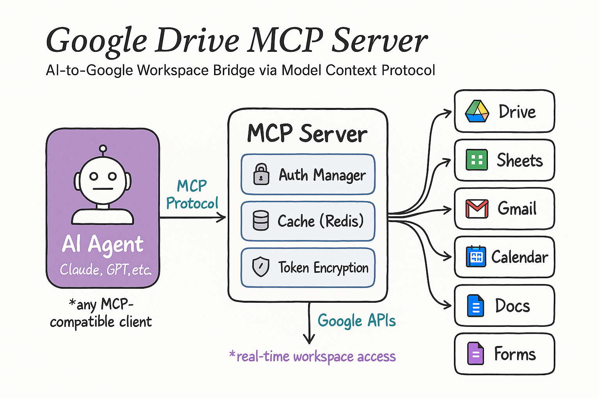

<div align="center">


### **Your AI can reason. But can it check your calendar?**

[](https://opensource.org/licenses/MIT)
[](https://www.typescriptlang.org/)
[](https://modelcontextprotocol.io)
[](https://workers.cloudflare.com/)
[](https://github.com/AojdevStudio/gdrive/releases)
[](https://github.com/AojdevStudio/gdrive/pulls)

*The complete Google Workspace bridge for AI agents — 47 operations, one URL.*

[**See It In Action**](#see-it-in-action) · [**Quick Start**](#quick-start) · [**Documentation**](./docs/README.md)

</div>

---

## The Problem

AI agents can write code, analyze documents, and plan complex projects. But ask one to send an email, schedule a meeting, or update a spreadsheet — and it hits a wall.

- Your agent drafts a project plan but can't put it in Google Docs
- It analyzes data but can't write results back to Sheets
- It schedules tasks but can't check anyone's calendar
- It composes emails but can't actually send them

**Google Workspace is where work lives.** If your AI can't touch it, your AI can't finish the job.

> *You don't need a smarter model. You need a model that can reach the tools people actually use.*

---

## The Insight

<div align="center">

### **AI agents don't lack intelligence.**
### **They lack hands.**

</div>

The [Model Context Protocol](https://modelcontextprotocol.io) gives AI agents a standardized way to interact with external tools. But most MCP servers require local installation, credential management, and manual path configuration before a single API call can be made.

**v4 changes this entirely.** Deploy once to Cloudflare Workers, get a URL. That URL is your MCP server — available everywhere, always-on, zero local setup required.

<div align="center">

## **One URL. Six services. Full autonomy.**

</div>

---

## What's New in v4.0.0

> **This is a breaking change release.** v4 introduces a 2-tool SDK architecture and remote Cloudflare Workers deployment. Local stdio, local HTTP, Docker, and local OAuth bootstrap runtimes are no longer supported MCP paths.

### Zero-Install Remote Deployment

Deploy the server to Cloudflare Workers and connect any MCP client with a single URL — no Node.js, no Docker, no path configuration. Just:

```
https://your-worker.workers.dev/mcp
```

Inspired by [Cloudflare's approach to remote MCP servers](https://blog.cloudflare.com/code-mode-mcp/) — thanks to [@mattzcarey](https://x.com/mattzcarey) for surfacing this.

### 2-Tool SDK Architecture

| Tool | Purpose |
|:-----|:--------|
| `search` | Query Google Workspace via natural language SDK spec |
| `execute` | Run sandboxed JavaScript with full googleapis SDK access |

**88% fewer tools** in your agent's context window. The SDK handles the rest dynamically.

### KV-Backed Token Storage

OAuth tokens stored in Cloudflare KV — encrypted, persistent, no local credential files needed.

---

## Introducing gdrive MCP Server

A production-ready MCP server that gives AI agents complete, secure access to Google Workspace.

| Service | Operations | Highlights |
|:--------|:-----------|:-----------|
| **Drive** | 7 | Search, enhanced search, read, create, update, batch operations |
| **Sheets** | 12 | Read/write cells, formulas, formatting, conditional formatting, freeze, column width |
| **Gmail** | 10 | List, search, read, draft, **send emails**, send drafts, manage labels |
| **Calendar** | 9 | Full CRUD, **natural language quickAdd**, free/busy checks |
| **Docs** | 5 | Create, insert text, replace, **rich text styling**, insert tables |
| **Forms** | 4 | Create forms, add questions, read responses |
| | **47 total** | |

---

## See It In Action

<details>
<summary><b>Send an email and schedule a follow-up — in two calls</b></summary>

```json
// 1. Send the email
{
  "tool": "gmail",
  "args": {
    "operation": "sendMessage",
    "to": "team@company.com",
    "subject": "Q1 Report Ready",
    "body": "The Q1 report is complete. Link: https://docs.google.com/..."
  }
}

// 2. Schedule the review meeting
{
  "tool": "calendar",
  "args": {
    "operation": "quickAdd",
    "text": "Q1 Report Review with team tomorrow at 2pm",
    "calendarId": "primary"
  }
}
```

</details>

<details>
<summary><b>Build a formatted spreadsheet from scratch</b></summary>

```json
// 1. Create the spreadsheet
{ "tool": "drive", "args": { "operation": "createFile", "name": "Sales Dashboard", "mimeType": "application/vnd.google-apps.spreadsheet" } }

// 2. Add data
{ "tool": "sheets", "args": { "operation": "updateCells", "spreadsheetId": "...", "range": "Sheet1!A1:D4",
    "values": [["Region", "Q1", "Q2", "Total"], ["North", 50000, 62000, ""], ["South", 43000, 51000, ""], ["West", 67000, 71000, ""]] } }

// 3. Add formulas
{ "tool": "sheets", "args": { "operation": "updateFormula", "spreadsheetId": "...", "range": "D2:D4", "formula": "=B2+C2" } }

// 4. Format the header row
{ "tool": "sheets", "args": { "operation": "formatCells", "spreadsheetId": "...", "sheetId": 0,
    "range": { "startRowIndex": 0, "endRowIndex": 1 },
    "format": { "textFormat": { "bold": true }, "backgroundColor": { "red": 0.2, "green": 0.4, "blue": 0.8 } } } }

// 5. Freeze the header
{ "tool": "sheets", "args": { "operation": "freezeRowsColumns", "spreadsheetId": "...", "sheetId": 0, "frozenRowCount": 1 } }
```

</details>

<details>
<summary><b>Check availability and book a meeting</b></summary>

```json
// 1. Check if everyone is free
{ "tool": "calendar", "args": { "operation": "checkFreeBusy",
    "timeMin": "2025-03-15T14:00:00Z", "timeMax": "2025-03-15T15:00:00Z",
    "items": ["alice@company.com", "bob@company.com"] } }

// 2. Book it
{ "tool": "calendar", "args": { "operation": "createEvent", "calendarId": "primary",
    "summary": "Design Review", "start": "2025-03-15T14:00:00Z", "end": "2025-03-15T15:00:00Z",
    "attendees": ["alice@company.com", "bob@company.com"],
    "description": "Reviewing the new dashboard designs" } }
```

</details>

---

## Quick Start

### Remote (Cloudflare Workers)

Deploy once to Cloudflare's edge and connect MCP clients to the Worker `/mcp` URL. Local stdio, local HTTP, Docker, and local OAuth bootstrap runtimes are not supported.

**Prerequisites:**
- [Cloudflare account](https://dash.cloudflare.com/sign-up) (free tier works)
- [Node.js 22+](https://nodejs.org/en/download) for contributor build/deploy commands
- [Wrangler CLI](https://developers.cloudflare.com/workers/wrangler/install-and-update/): `npm install -g wrangler` or use `npx wrangler`
- [Google Cloud project](./docs/Guides/01-initial-setup.md) with OAuth credentials
- [`just`](https://just.systems/man/en/packages.html) — `brew install just` (macOS) · `winget install just` (Windows) · `cargo install just` (cross-platform)

> **Guided setup:** Run `just install` to have Claude walk you through every step interactively — GCP project creation, API enablement, OAuth credentials, KV setup, and deploy. Or follow the steps below manually.

#### 1. Clone and install

```bash
git clone https://github.com/AojdevStudio/gdrive.git
cd gdrive
npm install && npm run build
```

#### 2. Authenticate with Cloudflare

```bash
npx wrangler login
```

#### 3. Create KV namespace for token storage

```bash
npx wrangler kv:namespace create GDRIVE_KV --preview false
# Copy the `id` from the output, update [[kv_namespaces]] id in wrangler.toml
```

#### 4. Configure Worker secrets

```bash
npx wrangler secret put GDRIVE_CLIENT_ID
npx wrangler secret put GDRIVE_CLIENT_SECRET
npx wrangler secret put GDRIVE_TOKEN_ENCRYPTION_KEY
npx wrangler secret put MCP_BEARER_TOKEN
npx wrangler secret put MCP_SETUP_TOKEN
```

> **Don't have Google Cloud credentials?** Follow the [Google Cloud setup guide](./docs/Guides/01-initial-setup.md) — or run `just install` for a fully guided walkthrough.

#### 5. Deploy

```bash
npx wrangler deploy
# Note the URL printed: https://your-worker.workers.dev
```

#### 6. Complete remote Google OAuth setup

Open the setup route with setup bearer auth:

```bash
curl -i -H "Authorization: Bearer $MCP_SETUP_TOKEN" \
  https://your-worker.workers.dev/setup/google/start
```

After Google redirects back to the Worker callback, verify state:

```bash
curl -H "Authorization: Bearer $MCP_SETUP_TOKEN" \
  https://your-worker.workers.dev/setup/status
```

#### 7. Connect MCP clients

**Claude Code CLI — User scope** (available in every project, stored in `~/.claude/settings.json`):

```bash
claude mcp add --scope user --transport http google-workspace https://your-worker.workers.dev/mcp
```

**Claude Code CLI — Project scope** (this project only, can be committed to the repo):

```bash
claude mcp add --scope project --transport http google-workspace https://your-worker.workers.dev/mcp
```

> **Why user scope?** An MCP server that connects to *your* Google account belongs at the user level — not locked to one project. Use `--scope project` only when the server is project-specific (different Google account, different permissions).

**Claude Desktop** — add to `~/Library/Application Support/Claude/claude_desktop_config.json`:

```json
{
  "mcpServers": {
    "google-workspace": {
      "url": "https://your-worker.workers.dev/mcp"
    }
  }
}
```

---

## How It Works

<div align="center">



</div>

### Operation-Based Tool Pattern

Instead of 47 separate tools competing for your agent's attention, the server exposes **6 tools** with an `operation` parameter:

```typescript
// One tool per service, operation parameter for routing
{
  name: "sheets",
  args: {
    operation: "formatCells",    // ← The operation discriminator
    spreadsheetId: "abc123",
    sheetId: 0,
    range: { startRowIndex: 0, endRowIndex: 1 },
    format: { textFormat: { bold: true } }
  }
}
```

This means **88% fewer tools** in your agent's context window — faster tool selection, lower token cost, better results.

### Security

- **AES-256-GCM encryption** for all stored tokens
- **Automatic OAuth refresh** — authenticate once, works forever
- **Key rotation** with V1-V4 versioned keys
- **Structured operation execution** through the Google Workspace SDK
- **Comprehensive audit trail** in structured logs

---

## The Story

This project started because we kept hitting the same wall: AI agents that could think brilliantly but couldn't *do* anything in the real world.

Every time we wanted an agent to update a spreadsheet, check a calendar, or send an email, we had to leave the AI loop, do it manually, and come back. The agent was a great thinker trapped in a box.

MCP changed the game by giving agents a standard way to use tools. But the existing Google integrations were shallow — basic file read/write, no formatting, no email sending, no calendar management. We needed something that matched the depth of what people actually do in Google Workspace every day.

So we built it. Starting with Drive and Sheets, then Forms and Docs, then Gmail (with actual sending, not just drafts), and finally Calendar with full CRUD and natural language scheduling. Each release driven by the same question: *"What does an agent need to actually finish this job without human intervention?"*

v4 answers the next question: *"What does a developer need to connect their agent in under 60 seconds?"* One URL. That's the answer.

<div align="center">

### The best AI assistant isn't the smartest one. It's the one that can actually get things done.

</div>

---

## Complete API Reference

### All 47 Operations

<details>
<summary><b>Drive — 7 operations</b></summary>

| Operation | Description |
|:----------|:------------|
| `search` | Search files with queries |
| `enhancedSearch` | Natural language search with intelligent filtering |
| `read` | Read file content (auto-converts Google formats) |
| `createFile` | Create new files |
| `createFolder` | Create new folders |
| `updateFile` | Update existing files |
| `batchOperations` | Bulk create/update/delete/move |

</details>

<details>
<summary><b>Sheets — 12 operations</b></summary>

| Operation | Description |
|:----------|:------------|
| `listSheets` | List all sheets in a spreadsheet |
| `readSheet` | Read data from a range |
| `createSheet` | Create a new sheet tab |
| `renameSheet` | Rename a sheet tab |
| `deleteSheet` | Delete a sheet tab |
| `updateCells` | Write values to cells |
| `updateFormula` | Write formulas with relative reference support |
| `formatCells` | Apply formatting (bold, colors, borders, number formats) |
| `addConditionalFormat` | Add conditional formatting rules |
| `freezeRowsColumns` | Freeze header rows/columns |
| `setColumnWidth` | Adjust column widths |
| `appendRows` | Append rows to end of data |

</details>

<details>
<summary><b>Gmail — 10 operations</b></summary>

| Operation | Description |
|:----------|:------------|
| `listMessages` | List messages with optional query |
| `listThreads` | List email threads |
| `getMessage` | Get full message content |
| `getThread` | Get full thread content |
| `searchMessages` | Advanced message search |
| `createDraft` | Create email draft |
| `sendMessage` | Send email (supports send-as aliases) |
| `sendDraft` | Send an existing draft |
| `listLabels` | List all Gmail labels |
| `modifyLabels` | Add/remove labels on messages |

</details>

<details>
<summary><b>Calendar — 9 operations</b></summary>

| Operation | Description |
|:----------|:------------|
| `listCalendars` | List available calendars |
| `getCalendar` | Get calendar details |
| `listEvents` | List events in a time range |
| `getEvent` | Get event details |
| `createEvent` | Create a new event with attendees |
| `updateEvent` | Modify an existing event |
| `deleteEvent` | Delete event with notification options |
| `quickAdd` | Natural language event creation |
| `checkFreeBusy` | Check availability for scheduling |

</details>

<details>
<summary><b>Docs — 5 operations</b></summary>

| Operation | Description |
|:----------|:------------|
| `createDocument` | Create a new document |
| `insertText` | Insert text at a position |
| `replaceText` | Find and replace text |
| `applyTextStyle` | Apply formatting (bold, italic, colors, fonts) |
| `insertTable` | Insert a table with custom dimensions |

</details>

<details>
<summary><b>Forms — 4 operations</b></summary>

| Operation | Description |
|:----------|:------------|
| `createForm` | Create a new form |
| `readForm` | Get form structure and details |
| `addQuestion` | Add questions (text, multiple choice, checkboxes, scales) |
| `listResponses` | Retrieve form responses |

</details>

---

## Roadmap

- [x] Google Drive — file management and search
- [x] Google Sheets — full spreadsheet control with formatting
- [x] Google Forms — form creation and response management
- [x] Google Docs — document creation and rich text editing
- [x] Gmail — complete email management including send
- [x] Calendar — full CRUD with natural language scheduling
- [x] Cloudflare Workers — zero-install remote deployment
- [ ] Google Slides — presentation creation and editing
- [ ] Google Chat — workspace messaging integration
- [ ] Contacts — contact management and lookup
- [ ] Tasks — Google Tasks integration

## Contributing

We welcome contributions! The codebase is TypeScript with a clean module structure:

```
src/modules/
  drive/     — 9 files
  sheets/    — 9 files
  gmail/     — 12 files
  calendar/  — 13 files
  docs/      — 2 files
  forms/     — 7 files
```

1. Fork and create a feature branch
2. Follow existing TypeScript/ESLint conventions
3. Add tests (Jest) and update docs
4. `npm run lint && npm test && npm run build`
5. Open a PR with a clear description

**[Contributing Guide](./CONTRIBUTING.md)** · **[Development Setup](./docs/Developer-Guidelines/README.md)**

## License

MIT — see [LICENSE](./LICENSE) for details.

---

<div align="center">

**Your AI agent can now do everything you do in Google Workspace.**

If this project helps your agents get work done, [give it a star](https://github.com/AojdevStudio/gdrive).

[](https://star-history.com/#AojdevStudio/gdrive&Date)

</div>
