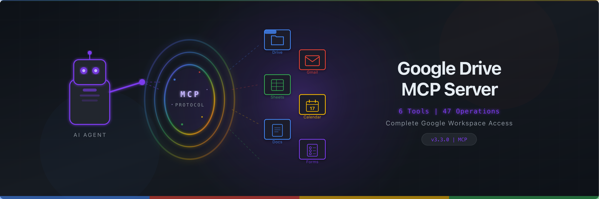

<div align="center">



# AOJ Workbench

### One remote MCP endpoint for Drive, Sheets, Forms, Docs, Gmail, and Calendar.

[](https://opensource.org/licenses/MIT)
[](https://www.typescriptlang.org/)
[](https://modelcontextprotocol.io)
[](https://workers.cloudflare.com/)
[](https://github.com/AojdevStudio/gdrive/releases)

*Give an AI agent a URL and it can work across your Google Workspace API surface.*

[**Quick Start**](#quick-start) . [**Services**](#services) . [**Docs**](./docs/README.md)

</div>

---

## Remote Only

AOJ Workbench is a **remote HTTP MCP server** hosted on Cloudflare Workers.

The supported client experience is:

```text
https://your-worker.workers.dev/mcp
```

There is no supported local stdio server, local HTTP server, Docker runtime, or local bootstrap flow for MCP clients. Clients connect to the remote `/mcp` endpoint by URL.

Legacy local commands and Docker instructions from older versions are not part of the supported runtime model.

## Why This Exists

AI agents can draft plans, reason over code, and summarize documents, but work usually finishes in Google Workspace:

- Send and search Gmail messages
- Read and update Sheets
- Create and edit Docs
- Search and write Drive files
- Create Forms and read responses
- Check Calendar availability and create events

AOJ Workbench gives agents that working surface through one remote MCP endpoint.

## Quick Start

### 1. Get The Endpoint

Use the deployed Worker URL:

```text
https://your-worker.workers.dev/mcp
```

The Worker must already be deployed and configured with Google Workspace OAuth state, Cloudflare KV, and any required MCP bearer token.

### 2. Connect Claude Code

Use a descriptive MCP server name so agents understand the full surface area:

```bash
claude mcp add --scope user --transport http google-workspace https://your-worker.workers.dev/mcp
```

If bearer auth is enabled for the Worker, configure the same bearer token expected by the server.

### 3. Connect Codex

```bash
export GOOGLE_WORKSPACE_MCP_TOKEN="replace-with-worker-token"

codex mcp add google-workspace \
  --url https://your-worker.workers.dev/mcp \
  --bearer-token-env-var GOOGLE_WORKSPACE_MCP_TOKEN
```

Start a fresh Codex session after changing MCP config.

## Services

| Service | Operations | Highlights |
|:--------|:-----------|:-----------|
| **Drive** | 7 | Search, enhanced search, read, create, update, batch operations |
| **Sheets** | 12 | Read/write cells, formulas, formatting, conditional formatting, freeze, column width |
| **Gmail** | 30+ | List, search, read, draft, send emails, manage labels, and work with attachments |
| **Calendar** | 9 | Full CRUD, natural language quickAdd, free/busy checks |
| **Docs** | 5 | Create, insert text, replace, rich text styling, insert tables |
| **Forms** | 4 | Create forms, add questions, read responses |
| | **70+ total** | |

## Tools

v4 exposes two MCP tools:

| Tool | Purpose |
|:-----|:--------|
| `search` | Discover available Google Workspace services, operations, signatures, parameters, and examples |
| `execute` | Run a specific Google Workspace operation through the SDK-style runtime |

This keeps the MCP tool list small while preserving the full Google Workspace API surface behind AOJ Workbench.

Example direct operation call:

```json
{
  "tool": "execute",
  "args": {
    "service": "gmail",
    "operation": "sendMessage",
    "args": {
      "to": "team@example.com",
      "subject": "Q1 report ready",
      "body": "The Q1 report is ready for review."
    }
  }
}
```

Example discovery call:

```json
{
  "tool": "search",
  "args": {
    "service": "sheets",
    "operation": "updateCells"
  }
}
```

## Architecture

```text
MCP client
  |
  | Streamable HTTP
  v
Cloudflare Worker /mcp
  |
  | Google OAuth token resolution and refresh
  v
Google Workspace APIs
```

Persistent state belongs in Cloudflare services, primarily Workers KV. The user-facing MCP runtime is the Worker URL.

## Security

- MCP clients authenticate to the Worker with static bearer auth when configured.
- Google OAuth authorizes the Worker to call Google Workspace APIs.
- This server is not an OAuth authorization server for MCP clients.
- Do not point MCP client auth metadata at Google OAuth.

See [MCP Client Auth Boundary](./docs/adr/0001-mcp-client-auth-boundary.md).

## Development

Development commands are for contributors changing the Worker implementation, not for running the MCP server locally as a client dependency.

```bash
npm test
npm run type-check
npm run build:worker
npm run deploy:worker
```

Do not add local stdio, local HTTP, or Docker connection instructions back to user-facing docs.

## Roadmap

- [x] Google Drive — file management and search
- [x] Google Sheets — spreadsheet control with formatting
- [x] Google Forms — form creation and response management
- [x] Google Docs — document creation and rich text editing
- [x] Gmail — email management including send
- [x] Calendar — CRUD with natural language scheduling
- [x] Cloudflare Workers — remote HTTP MCP runtime
- [ ] Google Slides — presentation creation and editing
- [ ] Google Chat — workspace messaging integration
- [ ] Contacts — contact management and lookup
- [ ] Tasks — Google Tasks integration

## Contributing

This repo is TypeScript and Cloudflare Workers based. Keep changes aligned with the remote-only runtime boundary.

1. Fork and create a feature branch.
2. Follow existing TypeScript and ESLint conventions.
3. Add tests for behavior changes.
4. Run the relevant checks.
5. Open a PR with a clear description.

## License

MIT — see [LICENSE](./LICENSE) for details.
