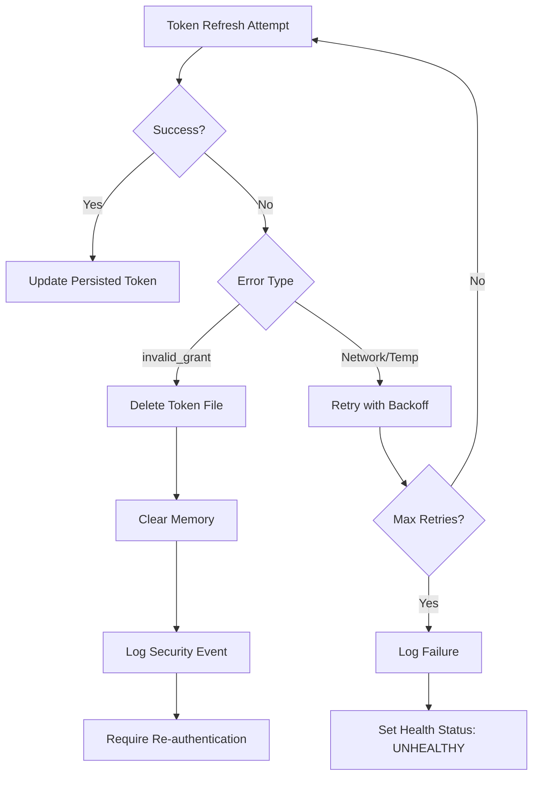

# OAuth Token Refresh Implementation for gdrive-mcp

## Metadata
- **Priority:** High
- **Status:** Todo
- **Assignee:** AI Agent
- **Estimate:** 8 hours
- **Issue ID:** ENG-001
- **Labels:** 
  - type:feature
  - priority:high
  - agent-ready
  - backend
  - authentication
  - security

## Problem Statement

### What
Implement automatic OAuth token refresh functionality in the gdrive MCP server to eliminate manual re-authentication when Google OAuth2 access tokens expire (~1 hour).

### Why
- **User Experience:** Manual re-authentication every hour creates a poor user experience and workflow disruption
- **Reliability:** Automatic token refresh ensures seamless API access without interruption
- **Production Readiness:** Essential for production deployments where manual intervention is not feasible
- **Efficiency:** Reduces support burden and authentication-related issues

### Context
The current implementation loads OAuth credentials statically at startup without any refresh capability. Google's access tokens expire after approximately 1 hour, requiring users to manually run `docker-compose run --rm gdrive-mcp-auth node dist/index.js auth` to refresh tokens. This is impractical for production use and long-running processes.

## Acceptance Criteria
- [ ] **AC1:** OAuth tokens automatically refresh before expiration without user intervention
- [ ] **AC2:** Refresh tokens are securely persisted to file system with proper permissions (0600)
- [ ] **AC3:** Token refresh events are logged and update persisted credentials
- [ ] **AC4:** Graceful error handling when refresh fails with clear user guidance
- [ ] **AC5:** Proactive token refresh occurs 10 minutes before expiration
- [ ] **AC6:** Docker health checks validate token status
- [ ] **AC7:** No disruption to existing API operations during token refresh

## Technical Requirements

### Core Security Requirements
- **Token Encryption at Rest (MANDATORY):** All persisted tokens MUST be encrypted using AES-256-GCM from node:crypto
  - Rationale: Unencrypted tokens on disk are vulnerable to compromise via disk images, backups, or file system access
  - Implementation: Use environment-specific encryption key, rotate keys periodically
  - Key storage: Store encryption key separately from encrypted data (e.g., environment variable)
- **Secure File Permissions:** Token files MUST have 0600 permissions (owner read/write only)
- **Memory Protection:** Clear sensitive data from memory after use
- **Audit Trail:** All token operations MUST be logged for security forensics

### Implementation Notes
- Replace static auth setup with OAuth2Client instance that supports token events
- Implement `tokens` event listener for automatic credential persistence
- Add TokenManager class for proactive token monitoring and refresh
- Use file-based storage for refresh tokens with AES-256-GCM encryption
- Implement retry logic with exponential backoff for failed refreshes
- Add mutex/locking to prevent concurrent refresh attempts
- Ensure refresh token is preserved across access token refreshes
- Delete persisted tokens immediately on `invalid_grant` errors to prevent retry loops

### Testing Requirements
- [ ] **Unit Tests** - Framework: Jest, Coverage: 90%, Location: `src/__tests__/auth/`
- [ ] **Integration Tests** - Framework: Jest, Location: `src/__tests__/integration/`
- [ ] **E2E Tests** - Framework: Jest + Docker, Location: `tests/e2e/`

### Dependencies
- **Blockers:** None
- **Related:** Docker health check implementation
- **Files to Modify:** 
  - `src/index.ts` (lines 1924-1935)
  - `src/auth/TokenManager.ts` (new file)
  - `src/auth/AuthManager.ts` (new file)
  - `docker-compose.yml`
  - `Dockerfile`

## Definition of Done
- [ ] All acceptance criteria met
- [ ] Code reviewed and approved
- [ ] Tests written and passing (per testing requirements)
- [ ] Documentation updated (README.md, API docs)
- [ ] Deployed to staging environment
- [ ] Manual verification completed
- [ ] Docker health checks passing

## Agent Context

### Reference Materials
- Google OAuth2 documentation: https://developers.google.com/identity/protocols/oauth2
- Google Auth Library Node.js: https://github.com/googleapis/google-auth-library-nodejs
- OAuth token refresh research: `docs/Research/oauth-token-refresh-research.md`
- Persistent auth research: `docs/Research/persistent-oauth-authentication-gdrive-mcp.md`

### Integration Points
- Google OAuth2 API for token refresh
- File system for credential persistence
- Docker health check endpoint
- Existing Google Drive API operations
- Redis cache invalidation on token refresh

## Validation Steps

### Automated Verification
- [ ] Build pipeline passes
- [ ] All tests green (unit, integration, E2E)
- [ ] Code quality checks pass (ESLint, TypeScript)
- [ ] Security scans clean (no exposed tokens in logs)
- [ ] Docker health checks report healthy

### Manual Verification
1. **Step 1:** Start fresh without existing credentials, verify initial auth flow works
2. **Step 2:** Wait 55 minutes, verify token auto-refreshes without interruption
3. **Step 3:** Force token expiration, verify proactive refresh triggers
4. **Step 4:** Simulate refresh failure, verify retry logic and error messages
5. **Step 5:** Restart server, verify tokens load from persistent storage
6. **Step 6:** Check file permissions on token storage (should be 0600)

## Agent Execution Record

### Branch Strategy
- **Name Format:** feature/ENG-001-oauth-token-refresh
- **Linear Example:** feature/ENG-001-oauth-token-refresh
- **GitHub Example:** feature/#001-oauth-token-refresh

### PR Strategy
Link to this issue using magic words in PR description

### Implementation Approach
1. Create TokenManager class with event-based token handling
2. Replace static auth setup with OAuth2Client instance
3. Implement secure file-based token persistence
4. Add proactive token monitoring with scheduled refresh
5. Implement comprehensive error handling and retry logic
6. Update Docker configuration with health checks
7. Add monitoring and logging for token lifecycle

### Error Handling Flow


### Health Check States
- **HEALTHY:** Token valid AND (expiry > 10 minutes OR successful recent refresh)
- **DEGRADED:** Token expiring soon AND refresh attempts in progress
- **UNHEALTHY:** Token expired AND refresh attempts failed OR no valid token present

### Audit Trail Requirements
All token operations MUST generate structured audit logs for security forensics:

```json
{
  "timestamp": "2024-01-20T15:30:45.123Z",
  "event": "TOKEN_REFRESHED",
  "userId": "user@example.com",
  "tokenId": "sha256_hash_of_token",
  "success": true,
  "metadata": {
    "expiresIn": 3600,
    "refreshAttempt": 1,
    "source": "proactive_refresh"
  }
}
```

**Required Audit Events:**
- `TOKEN_ACQUIRED`: Initial token obtained through auth flow
- `TOKEN_REFRESHED`: Successful token refresh
- `TOKEN_REFRESH_FAILED`: Failed refresh attempt with error details
- `TOKEN_REVOKED_BY_USER`: User manually revoked access
- `TOKEN_DELETED_INVALID_GRANT`: Token deleted due to invalid_grant error
- `TOKEN_ENCRYPTED`: Token encrypted for storage
- `TOKEN_DECRYPTED`: Token decrypted for use

### Completion Notes
[To be filled during implementation]

### PR Integration
- **Linear Magic Words:** Fixes ENG-001
- **GitHub Magic Words:** Closes #001
- **Auto Close Trigger:** PR merge to main branch
- **Status Automation:** Issue will auto-move from 'In Progress' to 'Done'

### Debug References
- Token refresh logs: `/app/logs/token-refresh.log`
- Performance metrics: Token refresh latency < 500ms
- Error handling: Retry attempts logged with exponential backoff

### Change Log
[Track changes made during implementation]

## Bot Automation Integration

### Branch Naming for Auto-Linking

#### Linear Examples
- feature/ENG-001-oauth-token-refresh
- bugfix/ENG-001-fix-token-persistence

#### GitHub Examples
- feature/#001-oauth-token-refresh
- hotfix/#001-refresh-security-patch

### PR Description Template
```markdown
## Description
Implements automatic OAuth token refresh functionality to eliminate manual re-authentication

**Linked Issues:**
- Fixes ENG-001

## Changes
- Added TokenManager class for automatic token refresh
- Implemented secure token persistence to file system
- Added proactive token monitoring
- Integrated retry logic with exponential backoff
- Updated Docker health checks

## Testing
- [ ] Unit tests pass
- [ ] Integration tests pass
- [ ] E2E tests pass
- [ ] Manual token refresh verified
```