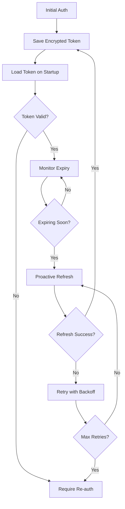

# Authentication Documentation

This document provides detailed information about the OAuth token refresh implementation in the gdrive-mcp server.

## Overview

The gdrive-mcp server implements automatic OAuth token refresh to eliminate the need for manual re-authentication every hour. This feature includes:

- Automatic token refresh before expiry
- Secure token storage with encryption
- Comprehensive audit logging
- Health monitoring
- Graceful error handling

## Architecture

### Components

1. **TokenManager** (`src/auth/TokenManager.ts`)
   - Handles secure token storage and retrieval
   - Implements AES-256-GCM encryption
   - Manages audit logging
   - Enforces file permissions (0600)

2. **AuthManager** (`src/auth/AuthManager.ts`)
   - Manages OAuth2Client lifecycle
   - Handles token refresh events
   - Implements proactive refresh monitoring
   - Provides mutex for concurrent operations

3. **Health Check** (`src/health-check.ts`)
   - Monitors token status
   - Reports health states (HEALTHY, DEGRADED, UNHEALTHY)
   - Integrates with Docker health checks

## Token Lifecycle



## Security Features

### Token Encryption

All tokens are encrypted at rest using AES-256-GCM:

```typescript
// Encryption format: iv:authTag:encryptedData
const encrypted = await tokenManager.encrypt(JSON.stringify(tokens));
```

### File Permissions

Token files are created with restrictive permissions:

```typescript
await fs.chmod(tokenPath, 0o600); // Owner read/write only
```

### Audit Logging

All token operations are logged in JSON format:

```json
{
  "timestamp": "2024-01-20T15:30:45.123Z",
  "event": "TOKEN_REFRESHED",
  "userId": "user@example.com",
  "tokenId": "sha256_hash_of_token",
  "success": true,
  "metadata": {
    "expiresIn": 3600,
    "refreshAttempt": 1,
    "source": "proactive_refresh"
  }
}
```

### Audit Events

- `TOKEN_ACQUIRED` - Initial token obtained
- `TOKEN_REFRESHED` - Successful refresh
- `TOKEN_REFRESH_FAILED` - Failed refresh attempt
- `TOKEN_REVOKED_BY_USER` - Manual revocation
- `TOKEN_DELETED_INVALID_GRANT` - Invalid grant cleanup
- `TOKEN_ENCRYPTED` - Token encrypted for storage
- `TOKEN_DECRYPTED` - Token decrypted for use

## Configuration

### Environment Variables

```bash
# Required - Generate 32 random bytes (44-character base64 string)
# Generate with: openssl rand -base64 32
GDRIVE_TOKEN_ENCRYPTION_KEY=base64_encoded_32_byte_key_44_chars

# Optional - Token refresh settings
GDRIVE_TOKEN_REFRESH_INTERVAL=1800000  # 30 minutes
GDRIVE_TOKEN_PREEMPTIVE_REFRESH=600000  # 10 minutes
GDRIVE_TOKEN_MAX_RETRIES=3
GDRIVE_TOKEN_RETRY_DELAY=1000

# Optional - File paths
GDRIVE_TOKEN_STORAGE_PATH=~/.gdrive-mcp-tokens.json
GDRIVE_TOKEN_AUDIT_LOG_PATH=~/.gdrive-mcp-audit.log
```

### Generating Encryption Key

```bash
# Generate a secure 32-byte key
openssl rand -base64 32

# Example output: vKjhsdGQ+9NiC4A6YPaVmfxRwXJgJLPUi7Gq7C9Nxno=
```

## Error Handling

### Invalid Grant Error

When Google returns an `invalid_grant` error:

1. Token is immediately deleted from storage
2. Audit event is logged
3. User must re-authenticate

```typescript
if (error.response?.data?.error === 'invalid_grant') {
  await tokenManager.deleteTokensOnInvalidGrant();
  throw new Error('Authentication required - refresh token invalid');
}
```

### Retry Logic

Temporary failures are retried with exponential backoff:

```typescript
const delays = [1000, 2000, 4000]; // 1s, 2s, 4s
for (let attempt = 0; attempt < maxRetries; attempt++) {
  try {
    return await refreshToken();
  } catch (error) {
    if (attempt < maxRetries - 1) {
      await delay(delays[attempt]);
    }
  }
}
```

### Rate Limiting

Google API rate limits are respected:

```typescript
if (error.response?.status === 429) {
  const retryAfter = error.response.headers['retry-after'];
  await delay(retryAfter * 1000);
}
```

## Health Monitoring

### Health States

1. **HEALTHY**
   - Token is valid
   - Expiry > 10 minutes OR recent refresh succeeded
   - Refresh token exists

2. **DEGRADED**
   - Token expiring within 10 minutes
   - Refresh attempt in progress

3. **UNHEALTHY**
   - Token expired AND refresh failed
   - No valid token present
   - No refresh token available

### Health Check Command

```bash
# Local
node dist/index.js health

# Docker
docker-compose exec gdrive-mcp node dist/index.js health
```

### Sample Health Response

```json
{
  "status": "HEALTHY",
  "timestamp": "2024-01-20T15:30:45.123Z",
  "checks": {
    "tokenStatus": {
      "status": "pass",
      "message": "Token is valid",
      "metadata": {
        "expiresIn": 2934,
        "state": "AUTHENTICATED"
      }
    },
    "refreshCapability": {
      "status": "pass",
      "message": "Token refresh capability available"
    }
  },
  "metrics": {
    "uptime": 3600,
    "memoryUsage": {
      "rss": 104857600,
      "heapTotal": 73728000,
      "heapUsed": 45678901
    }
  }
}
```

## Docker Integration

### Health Check Configuration

```yaml
healthcheck:
  test: ["CMD", "node", "dist/index.js", "health"]
  interval: 5m
  timeout: 10s
  retries: 3
  start_period: 30s
```

### Container States

- **healthy** - Token valid and refresh working
- **unhealthy** - Token issues detected
- **starting** - Within start_period

## Troubleshooting

### Common Issues

1. **"GDRIVE_TOKEN_ENCRYPTION_KEY environment variable is required"**
   - Generate key: `openssl rand -base64 32`
   - Set in environment or .env file

2. **"Invalid encryption key. Must be 32-byte base64-encoded key"**
   - Key is wrong length or not base64
   - Regenerate with correct command

3. **"No saved tokens found. Authentication required"**
   - Run initial auth: `node dist/index.js auth`
   - Check token file path permissions

4. **"Refresh token is invalid or revoked"**
   - Delete token file and re-authenticate
   - Check OAuth app settings in Google Cloud

### Debug Mode

Enable debug logging for detailed troubleshooting:

```bash
export LOG_LEVEL=debug
node dist/index.js
```

### Audit Log Analysis

```bash
# View recent token events
tail -f ~/.gdrive-mcp-audit.log | jq '.'

# Filter for failures
grep TOKEN_REFRESH_FAILED ~/.gdrive-mcp-audit.log | jq '.'

# Count refresh attempts
grep TOKEN_REFRESHED ~/.gdrive-mcp-audit.log | wc -l
```

## Best Practices

1. **Security**
   - Never commit encryption keys
   - Rotate encryption keys periodically
   - Monitor audit logs for anomalies
   - Use environment-specific keys

2. **Reliability**
   - Monitor health check status
   - Set up alerts for UNHEALTHY state
   - Test token refresh in staging
   - Keep refresh token secure

3. **Performance**
   - Use default refresh intervals
   - Don't refresh too frequently
   - Monitor API quota usage
   - Cache tokens in memory

## Migration Guide

### From Manual Authentication

1. Generate encryption key
2. Set environment variable
3. Run initial authentication
4. Remove old credential files
5. Update startup scripts

### Upgrading Existing Installation

1. Stop the server
2. Backup existing credentials
3. Set encryption key
4. Run auth command
5. Start server with new config
6. Verify health status

## API Reference

### TokenManager

```typescript
class TokenManager {
  saveTokens(tokens: TokenData): Promise<void>
  loadTokens(): Promise<TokenData | null>
  deleteTokensOnInvalidGrant(): Promise<void>
  isTokenExpired(tokens: TokenData): boolean
  isTokenExpiringSoon(tokens: TokenData, bufferMs?: number): boolean
}
```

### AuthManager

```typescript
class AuthManager {
  initialize(): Promise<void>
  getState(): AuthState
  getOAuth2Client(): OAuth2Client
  refreshToken(): Promise<void>
  stopTokenMonitoring(): void
}
```

### Health Check

```typescript
interface HealthCheckResult {
  status: HealthStatus
  timestamp: string
  checks: {
    tokenStatus: CheckResult
    refreshCapability: CheckResult
  }
  metrics?: PerformanceMetrics
}
```